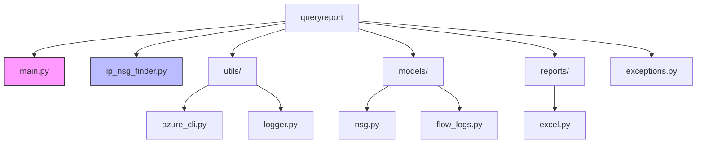
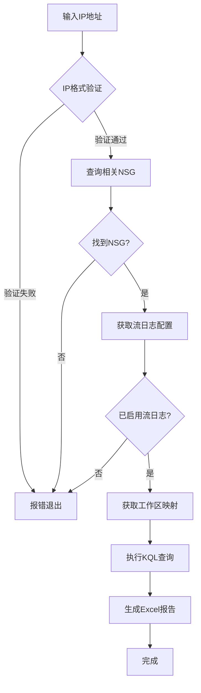

1# Azure IP流量分析工具

## 概述
本工具提供三个版本的脚本，用于全面分析Azure环境中特定IP地址的网络流量：
- `ip_nsg_finder.py` (Python脚本) - **最新版本**，专注于NSG发现和KQL查询
- `query_ip_azure_improved.sh` (Bash脚本) - 改进版本
- `query_ip_azure.py` (Python脚本) - 适用于无法运行Bash的环境

这些脚本采用高效的查询策略，**先定位IP相关资源和NSG，再查询关联的Log Analytics工作区**，避免遍历所有订阅和工作区，大幅提高执行效率。

## 前提条件
### 通用要求
- Azure CLI (最新版本)
- 对Azure订阅的适当访问权限
  - 至少需要"读取者"角色
  - 对Log Analytics工作区的查询权限
  - 对Azure Resource Graph的查询权限

### 最新Python脚本版本 (ip_nsg_finder.py)
- Python 3.7+
- 无需特殊的Azure SDK包，仅使用标准库和Azure CLI
- 可选：pandas 和 openpyxl (用于Excel报告生成)

### Bash脚本版本
- jq (JSON处理工具)
- bash环境 (Linux/macOS/Windows WSL)

### 旧版Python脚本版本 (query_ip_azure.py)
- Python 3.6+
- Azure SDK for Python
  - azure-identity
  - azure-mgmt-resource
  - azure-mgmt-network
  - azure-mgmt-monitor
  - azure-mgmt-loganalytics

## 项目结构
本项目采用模块化架构，设计为可自包含部署。核心组件组织如下：



### 关键组件说明
- **main.py**: 统一入口点，支持在任何位置运行脚本
- **ip_nsg_finder.py**: 核心业务逻辑实现
- **utils/**: 工具类模块，包含Azure CLI命令执行和日志处理
- **models/**: 数据模型类，包含NSG分析器和流日志管理器
- **reports/**: 报告生成模块，支持Excel导出
- **exceptions.py**: 自定义异常类定义

## 自包含设计
从2.1.0版本开始，本工具采用完全自包含设计，具有以下特点：

1. **可复制性**: 整个`queryreport`目录可以复制到任何位置并正常工作
2. **自动路径处理**: 动态识别运行环境，无需手动调整路径
3. **统一入口点**: 通过`main.py`提供标准化启动方式 
4. **模块化架构**: 使用相对导入，确保组件间引用不依赖安装位置

## 安装步骤
### 最新Python脚本版本
1. 确保已安装Python 3.7+和Azure CLI
2. 下载或复制整个`queryreport`目录到任意位置
3. （可选）安装pandas和openpyxl用于报告生成
   ```bash
   pip install pandas openpyxl
   ```

### Bash脚本版本
1. 下载脚本到本地目录
2. 赋予脚本执行权限
   ```bash
   chmod +x query_ip_azure_improved.sh
   ```
3. 确保已安装依赖工具
   ```bash
   # 安装jq (Ubuntu/Debian)
   sudo apt-get install jq
   
   # 安装jq (CentOS/RHEL)
   sudo yum install jq
   
   # 安装jq (macOS)
   brew install jq
   ```

### 旧版Python脚本版本
1. 安装所需Python包
   ```bash
   pip install azure-identity azure-mgmt-resource azure-mgmt-network azure-mgmt-monitor azure-mgmt-loganalytics
   ```

## 使用方法

### 最新版Python脚本 (推荐)
```bash
# 使用统一入口点运行（推荐）
python queryreport/main.py <IP地址>

# 指定查询时间范围（小时）
python queryreport/main.py <IP地址> --time-range 48

# 启用详细日志模式
python queryreport/main.py <IP地址> --verbose

# 直接使用ip_nsg_finder.py（作为模块）
python -m queryreport.ip_nsg_finder <IP地址>
```

### 从任意位置运行
脚本设计支持从任何位置运行，只需复制整个`queryreport`目录：
```bash
# 复制到目标位置
cp -r queryreport /path/to/destination/

# 运行分析
cd /path/to/destination
python queryreport/main.py 10.10.10.10
```

### 在Python代码中集成
```python
# 导入分析器类
from queryreport.ip_nsg_finder import NSGTrafficAnalyzer

# 创建分析器实例
analyzer = NSGTrafficAnalyzer("10.10.10.10")

# 执行分析
results = analyzer.full_analysis(time_range_hours=24)
```

### Bash脚本
```bash
./query_ip_azure_improved.sh <IP地址> [天数]
```

### 旧版Python脚本
```bash
python query_ip_azure.py <IP地址> [天数]
```

示例:
```bash
# 查询特定IP过去24小时的流量日志(默认)
python queryreport/main.py 10.10.10.10

# 使用Bash版本查询过去30天的流量日志
./query_ip_azure_improved.sh 10.10.10.10 30

# 使用旧版Python版本查询过去60天的流量日志
python query_ip_azure.py 10.10.10.10 60
```

## 最新版本 (ip_nsg_finder.py) 功能特点

### 主要优势
1. **无SDK依赖** - 仅依赖Azure CLI，无需安装额外的Python包
2. **自包含设计** - 整个目录可复制到任意位置正常运行
3. **增强型NSG搜索** - 同时查询单数和复数形式的地址前缀
4. **智能路径处理** - 自动识别运行环境，解决路径依赖问题
5. **改进的异常处理** - 结构化异常系统，更好的错误反馈
6. **优化查询性能** - 查询缓存和临时文件管理
7. **类型检测** - 自动区分公网和私网IP地址

### 输出内容
脚本执行后会在`output`目录中生成以下文件：

- **NSG分析报告**
  - `report_<IP地址>.xlsx` - 综合Excel报告
  - `analysis_<IP地址>/` - 分析结果目录

## 常见问题解决

### 找不到模块或导入错误
如果遇到模块导入错误：
- 确保使用`main.py`作为入口点运行脚本
- 或者使用`python -m queryreport.ip_nsg_finder`方式运行

### KQL查询执行错误
- 检查是否已登录Azure CLI (`az login`)
- 确认对Log Analytics工作区有查询权限
- 检查NSG流日志是否已配置

### Excel报告生成失败
- 安装必要的依赖：`pip install pandas openpyxl`
- 确保输出目录有写入权限

## 代码示例：完整流量分析

```python
from queryreport.ip_nsg_finder import NSGTrafficAnalyzer
from queryreport.utils import setup_logger

# 创建日志记录器
logger = setup_logger()

# 创建分析器实例
analyzer = NSGTrafficAnalyzer("10.0.0.1")

# 执行完整分析流程
success = analyzer.full_analysis(time_range_hours=48)

if success:
    logger.info("分析完成，请查看输出目录中的报告")
else:
    logger.error("分析过程中出现错误")
```

## 流程图：数据处理流程



## 问题反馈与贡献

如遇问题，请先尝试：
1. 使用最新版本的脚本
2. 确认Azure CLI已正确安装并登录
3. 检查必要的权限配置

## 更新日志

### v2.1.0 (当前版本)
- 自包含设计，可在任何位置运行
- 添加main.py统一入口点
- 改进NSG搜索逻辑，支持更多地址前缀形式
- 优化查询性能和临时文件管理
- 添加IP类型自动检测（公网/私网）
- 改进错误处理机制

### v2.0.0
- 完全重构为模块化架构
- 添加Excel报告生成功能
- 实现KQL查询结果处理优化
- 增强日志记录和颜色输出